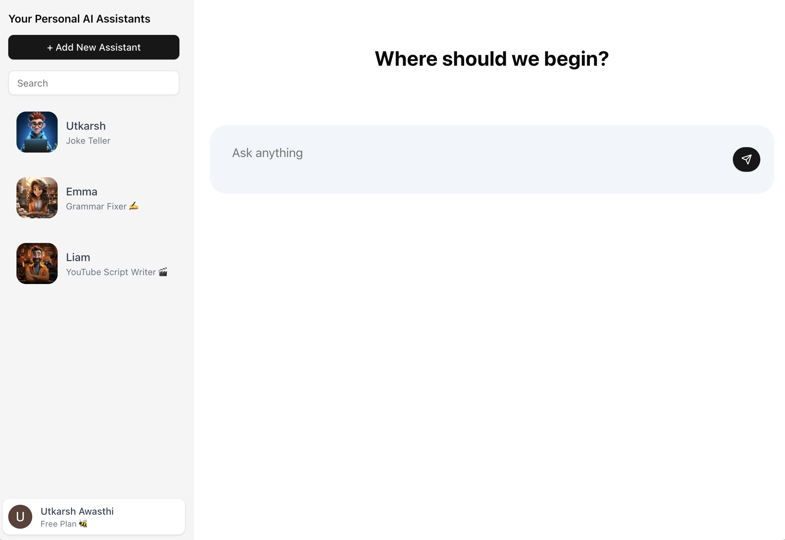
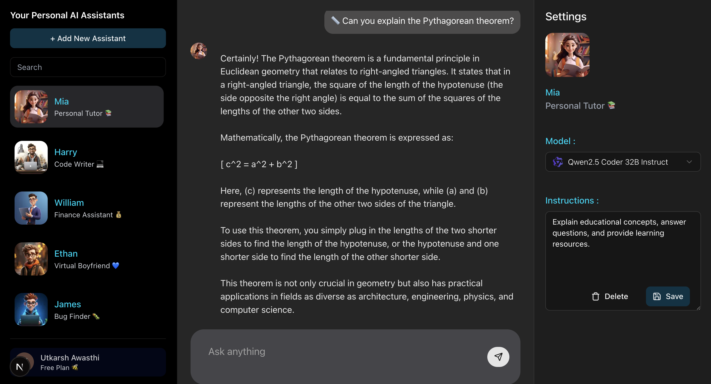
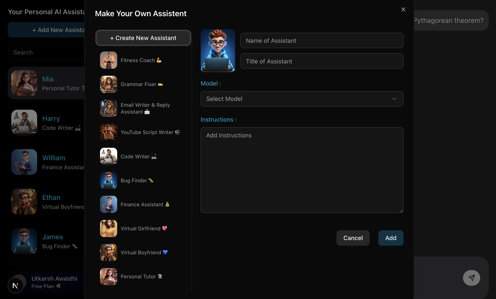

# 🤖 Personal AI Assistant — Next.js + LLM Chatbot

> Smart. Conversational. Context-Aware.  
> Your own AI assistant, built for real-world use — and ready for production.

---

## 📌 What is this?

A full-featured **AI-powered assistant chat app**, built using **Next.js 14**, with multi-model support (OpenRouter + Groq), context tracking, typing feedback, and a slick UI.  
It's designed to simulate a human-like, intelligent conversation — perfect for learning, productivity, or just chatting.

---

## 🚀 Features

✅ Seamless Chat UI with markdown support  
✅ Typing loader with *sarcastic AI responses* while waiting  
✅ Context-aware conversations  
✅ Dual model support:
  - 🧠 [OpenRouter](https://openrouter.ai) (Meta LLaMA 4/3/Scout/etc.)
  - ⚡ [Groq](https://groq.com) fallback when OpenRouter hits limits  
✅ Fallback logic on rate-limiting (`429` errors)  
✅ Custom Assistant Avatar with name/image  
✅ Dev-mode mocking to avoid API usage  
✅ Fully mobile-responsive  
✅ Secure & production-ready

---

## 🧠 AI Models

| Provider      | Model Examples               | Role            |
|---------------|------------------------------|-----------------|
| **OpenRouter** | `llama-4-maverick`, `scout`, etc. | Primary         |
| **Groq**       | `llama3-70b-8192`, `qwen-qwq-32b`  | Fallback Engine |

> The assistant will automatically switch to Groq if OpenRouter's free request limit is exceeded.

---

## 🛠️ Tech Stack

- **Next.js 14** (App Router, Server Actions)
- **React 18**
- **Tailwind CSS**
- **Lucide Icons**
- **OpenAI-compatible APIs** (OpenRouter + Groq)
- **TypeScript**
- **Axios** for API handling
- **Context API** for assistant management
- **Markdown rendering** via `react-markdown`

---

## 📸 Screenshots

| Chat Interface 💬 | Assistant Dialog 📎 |
|------------------|---------------------|
|  |  |

---

🧑‍💻 Author
Utkarsh Awasthi
🚀 Full Stack Developer | AI Enthusiast

📝 License
MIT — free for personal & educational use.
Just don’t forget to give credit 😉.